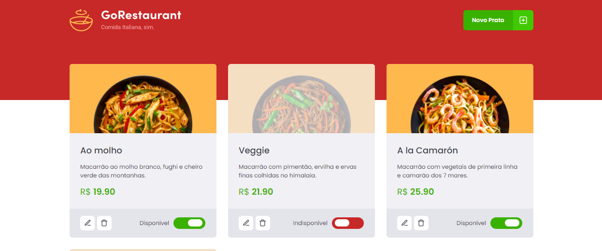

Projeto criado para o módulo 5 da rocketseat, Desafio: GoRestaurant Web.

GoRestaurant é um projeto simples apenas feito para trabalhar os fundamentos
de CRUD aprendidos no módulo de React, listando um cardápio de um restaurante

## Configuraçõs Iniciais

Apenas clonar o repositório e rodar "yarn" para instalar as dependências do projeto

## Scripts disponíveis

Para rodar o projeto basta executar

### `yarn`

Para instalar todas as dependências de pacotes do NPM

### `yarn start`

Roda a aplicação em modo de desenvolvimento. 
Abra [http://localhost:3000](http://localhost:3000) para ver o projeto no browser.

### `yarn json-server server.json -p 3333`

Roda uma fake API na porta 3333 (integrar depois com o backend feito anteriormente). 
Abra [http://localhost:3333](http://localhost:3333) para ver a fake api, os dados dela ficam 
armazenados no arquivo server.json

### `yarn test`

Para executar os testes necessários para a aplicação ser considerada criada com sucesso

## Fundamentos

Neste projeto foram colocados em prática os conhecimentos adquiridos no módulo 3 do curso de React, tais como:

- Axios;
- Styled Components;
- Typescript;
- Hooks;
- Promises;
